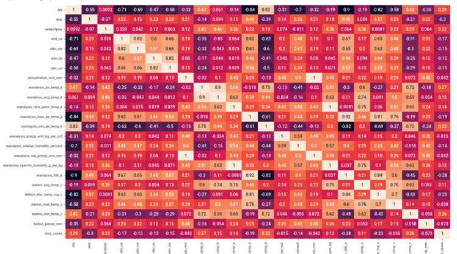
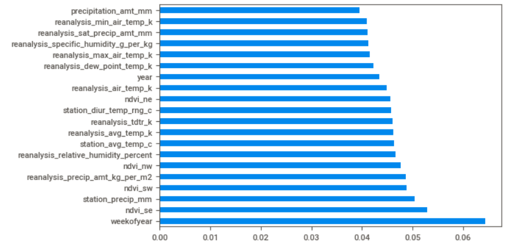
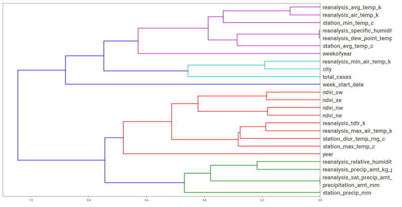
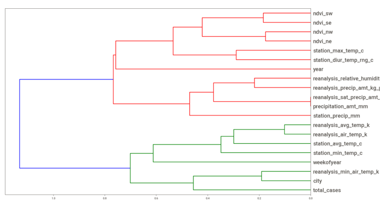

# Group-16 for DSBA 6162 KDD Project
## Members - 
- William (Billy) Edwards 
- Samihan Jawalkar
- Shubham Shah
- Reetesh Zope

## Introduction
Dengue is a viral disease that is transmitted by mosquitoes in tropical areas that affects millions of people each year of all nationalities. It is estimated that there are close to 390 million infections of the disease each year – including about 500,000 severe cases that mostly affect children. It is said that severe cases can cause extreme bleeding, low blood pressure, and eventually lead to death. Dengue is now considered endemic in over 100 countries and several US territories. The disease was once only located in Southeast Asia and the Pacific Islands. It is now spreading to parts of Latin America. More troubling for the US, in recent years, dengue outbreaks have hit several states where the Aedes vector mosquitoes are endemic.

The hope of this study aims to see if the spread of the disease is related to climate variables such as temperature, precipitation and humidity, and to see if steps can be taken to reduce the impact of Dengue and reduce future epidemics. Data has been collected from multiple sources to perform this study such as: US Federal Government agencies (like the Centers for Disease Control and Prevention and the National Oceanic and Atmospheric Administration), US Department of Commerce, and US universities.

## Domain Exploration and Resources
https://www.sciencedirect.com/science/article/pii/S0140673614605729?casa_token=4KzqW99aHm0AAAAA:Fd3Pk9W4rZLvaddr2m5bZwAUiLB_ck78mNn7PL31etzz8I3yb0YycbXVh8aiqnTm07OGofVt2fo
https://www.nejm.org/doi/full/10.1056/nejmra1110265

## Data Resources
https://www.drivendata.org/competitions/44/dengai-predicting-disease-spread/page/81/
https://obamawhitehouse.archives.gov/blog/2015/06/05/back-future-using-historical-dengue-data-predict-next-epidemic

## Research Question
The goal of this project is to see if humidity, precipitation, and vegetation index predicts the total Dengue cases for each (city, year, and weekofyear) in the test set. The project will be evaluated using the mean absolute error. There will be predictions for both the cities of San Juan and Iquitos. We will be applying this further, outside the scope of this competition, by also making total case predictions for a designated area in Singapore. Our group plans to use several types of analyses to help predict the total cases such as linear regression, random forests, and potentially neural networks. The linear regression will give us a baseline to compare the estimated cases when using the more advanced models like random forest.
### Exploratory Data Analysis Questions
- How have average air temperature and total precipitation changed over time?
- How does total cases correlate with mean dew point temperature?
- How does humidity level correlate with total cases?
- Does Vegitation Index has any role in disease spread?

## Dataset
The features in this dataset - dengue_features_train.csv:

We are provided the following set of information on a (year, weekofyear) timescale:

(Where appropriate, units are provided as a _unit suffix on the feature name.)
City and date indicators

    city – City abbreviations: sj for San Juan and iq for Iquitos
    week_start_date – Date given in yyyy-mm-dd format

NOAA's GHCN daily climate data weather station measurements

    station_max_temp_c – Maximum temperature
    station_min_temp_c – Minimum temperature
    station_avg_temp_c – Average temperature
    station_precip_mm – Total precipitation
    station_diur_temp_rng_c – Diurnal temperature range

PERSIANN satellite precipitation measurements (0.25x0.25 degree scale)

    precipitation_amt_mm – Total precipitation

NOAA's NCEP Climate Forecast System Reanalysis measurements (0.5x0.5 degree scale)

    reanalysis_sat_precip_amt_mm – Total precipitation
    reanalysis_dew_point_temp_k – Mean dew point temperature
    reanalysis_air_temp_k – Mean air temperature
    reanalysis_relative_humidity_percent – Mean relative humidity
    reanalysis_specific_humidity_g_per_kg – Mean specific humidity
    reanalysis_precip_amt_kg_per_m2 – Total precipitation
    reanalysis_max_air_temp_k – Maximum air temperature
    reanalysis_min_air_temp_k – Minimum air temperature
    reanalysis_avg_temp_k – Average air temperature
    reanalysis_tdtr_k – Diurnal temperature range

Satellite vegetation - Normalized difference vegetation index (NDVI) - NOAA's CDR Normalized Difference Vegetation Index (0.5x0.5 degree scale) measurements

    ndvi_se – Pixel southeast of city centroid
    ndvi_sw – Pixel southwest of city centroid
    ndvi_ne – Pixel northeast of city centroid
    ndvi_nw – Pixel northwest of city centroid

## Data Preparation/Preprocessing:
1. Importing train data set into jupyter notebook
2. Explore the datatypes and statistical information of the csv
3. Check for percentage of null vales
4. For any missing data that has less than 50% impute the data 
5. Impute based on the median value since most of the data has outliers. Imputing on the mean would skew the data by including the outliers
6. Convert "city" into a categorical variable using label encoder
7. Create a box plot matrix to look at outliers of each numerical variable
8. Drop outliers on variables that have 7 or less outliers 
9. Standardize the variables with outliers using StandardScaler to put them in the same range of values 
10. Put new standardized variables in trans_df dataframe
11. Plot new bow plot matrix to observe any remaining outliers from the standardized variables

## Exploratory Data Analysis:
1. Create a correlation matrix of the new dataframe to observe multicollinearity
2. Add a heat map of the correlation matrix to see the correlation visually

The lighter the color, the more positively correlated it is with a variable and vice-versa. This map makes it easier to spot multicollinearity. Here, there are many variables that might influence one another. For example, the satellite vegetation indices "ndvi" all seem to influence each other somewhat. The southeast centroid is 0.82 correlated with the southwest centroid. It may be best to keep only one southeast centroid. After running a regression and looking at VIF scores to confirm their influence on each other, one can be dropped from the model.

3. Make a scatter plot matrix to observe trends in the data
4. Create a histogram matrix to look at the distributions, and note any that might need to be later transformed after running a regression
5. Create a mask variable that will hide any features that do not have any correlation coefficient with less than 0.90
6. Apply this mask to the dataframe to see which variables have the most multicollinearity
7. Create a new dataframe "X_clean" that has the variables with multicollinearity above 0.90 dropped from it
8. Run sweetviz package to see association chart
9. Use RandomForestClassifier to see the features that will be most important to keep when running a regression in the next stage

The random forest model lists the feature importance for each remaining varaible in the data set in descending order. "Weekofyear" is shown as the best overall feature. When running our regression prediction, we can use this to create a threshold value. Any feature with less than 0.045 importance can be thrown out, and the remaining features can be kept. In this case, starting with "reanalysis_specific_humidity_g_per_kg" and below can be dropped before runnning a regression.

10. Marked a threshold of 0.045 and less to remove least important features in the futures
11. Make hierarchical cluster of each remaining variable to spot relationships, and visualize variable importance

The dendrogram above gives a visual on each feature, and depicts clustering relationship based on how related they are to other features. We can view the correlation of the variables and see that variable such as "ndvi" and its directions are all quite correlated with two clusters next to each other. After running a prediction model, only one may need to be kept to best model a case of dengue.

12. Generate second hierarchical cluster to see variable relationships after removing variables that had correlation coefficients with values less than 0.90

## Future Plan
1. Iteratively include latest data into dataset from different sources.
2. Planning to add some new feature which can make dataset more reliable. For instance, pollution level, environmental elements, etc.
3. Expand the study further to compare the spread of predicted total cases in the United States.  
